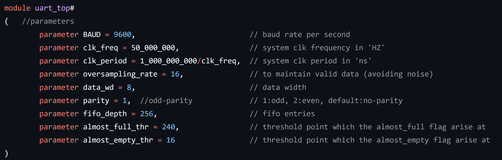
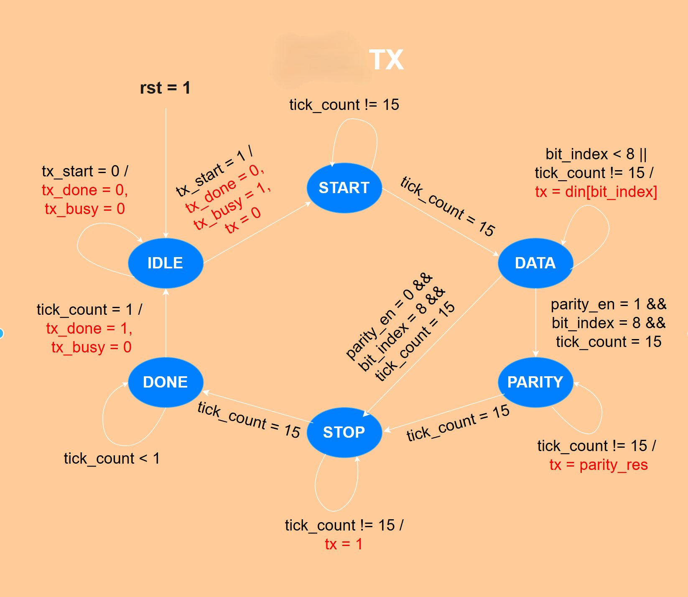
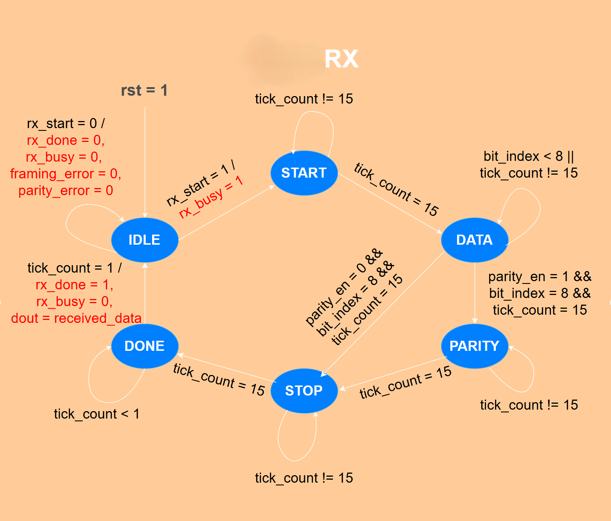
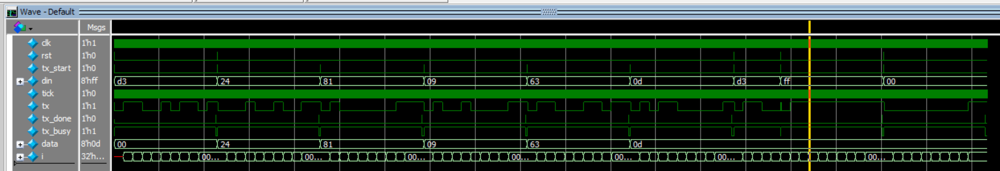

# (و ما توفيقى إلا بالله)
# 🧠 UART (Universal Asynchrounus Receiver/Transmitter)    

The project implements a **UART(Universal Asynchronous Receiver/Transmitter)** module using **Verilog HDL**, designed for FPGA-based digital systems. The design includes both transmitter **uart_tx** and receiver **uart_rx** modules, supporting configurable baud rate, parity checking, data width, fifo depth, and oversampling for noise reduction.      
The frame consists of: **start-bit**, **data-bits** LSB => MSB, **parity-bit** if enabled, and finally, **stop-bit**.   
### Frame Sequence  


--- 

## 📚 Table of Contents (TOC)      

- [Project Report](#project-report)
- [Folder Structure](#-folder-structure)
- [Block Diagram & Module Interfaces](#block-diagram--module-interfaces)
- [Reusability & Configurable Parameters](#reusability--configurable-parameters)
- [FSM](#fsm)
- [Testbenches](#-testbenches)
    - [Top TB](#top-tb)
    - [TX TB](#tx-tb)
    - [RX TB](#rx-tb)
    - [FIFO TB](#fifo-tb)
    - [Baud Generator TB](#baud-generator-tb)
- [How to Run](#-how-to-run)
- [Future Work](#-future-work)
- [Author](#-author)
- [NOTEs](#-notes)

---         

## Project Report

This is the project report for documentation: [click here](https://drive.google.com/file/d/14ZSK5BbisTxP29EgR_qmXAFrwZaKmRUV/view?usp=drive_link)

---         

## 📁 Folder Structure

```
UART_IP/
├── Docs/ # Block Diagram, State Digrams, transcript output, waveform snippets, ....
├── RTL/ # RTL Design
│   ├── uart_top.v
│   ├── uart_tx.v
│   ├── uart_rx.v
│   ├── uart_fifo.v
│   └── uart_baudgen.v
├── TB/ # Testbenches
│   ├── tb_top.v
│   ├── tb_rx.v
│   ├── tb_tx.v
│   ├── tb_fifo.v
│   ├── tb_baudgen.v
│   ├── test_rd.txt # for tb_fifo.v
│   └── test_wr.txt # for tb_fifo.v
├── Simulation/
│   ├── trans_out.log   # Sotres Transcript output for tb_top.v
│   ├── top.do  
│   ├── rx.do
│   ├── tx.do
│   ├── fifo.do
│   └── baudgen.do
├── LICENSE
└── README.md
```            

---         

## Block Diagram & Module Interfaces

The design consists of 5 modules: **TX**, **RX**, **Baud Generator**, **FIFO_TX**, and **FIFO_RX**. Baud Generator module generates a `tick` signal for **TX** and **RX**. Input data `din` gets into **FIFO_TX** then **FIFO_TX** feeds **TX** module. Data is transmitted bit-by-bit on line `tx_rx` from **TX** to **RX**. `dout_rx` gets into **FIFO_RX** then **FIFO_RX** buffers `dout_rx` as `dout`. 

### Block Diagram       


---             

## Reusability & Configurable Parameters

The design is considered **Fully Parameterized**. It has 9 parametrs.       
### Parameter Declaration      
      

- **BAUD**: Baud rate per second. `uart_baudgen` generates a tick pulse every **BAUD** clk cycles. Default value & most common rate used is *9600*.
- **clk_freq**: Frequency of system clk signal. Default value is *50 MHZ*. 
- **clk_period**: The period of the clk signal. It measured in **ns**.  
- **oversampling_rate**: Used to sample data bits to avoid noise or glitches on line. Default value & most common rate used is *16*.    
- **data_wb**: Data Width. Default value is *8*. 
- **parity**: This for parirty enable & type. If(parity == 1), **odd-parity**. Else if(parity == 2), **even-parity**. Else, no-parity: parity is disabled. Default value is *1: odd-parity*. 
- **fifo_depth**: Number of max frames can **FIFO_TX** or **FIFO_RX** store. Default value is *256*.    
- **almost_full_thr**: This is for FIFOs. If the FIFO stores frames greater than or equal **almost_full_thr**, Flag **almost_full** goes high. Default value is *240*.        
- **almost_empty_thr**: This is for FIFOs. If the FIFO stores frames less than or equal **almost_empty_thr**, Flag **almost_empty** goes high. Default value is *16*.           

---             

## FSM

The design works under a finite state machine **FSM**, consists of six states.  

### State Encoding Table (One-Hot)
Used **One-Hot** encoding to minimize glitches and enhance effeciency.

| # |   Encoding    |   Name    |   Description                                                             |
|---|---------------|-----------|---------------------------------------------------------------------------|
| 1 |   6'b000_001  | **IDLE**  | Waits for signal **tx_start** and **rx_start**.                           |
| 2 |   6'b000_010  | **START** | **TX** sends **start-bit** & then **RX** receives it.                     |
| 3 |   6'b000_100  | **DATA**  | **TX** sends **data-bits** & then **RX** receives them.                   |
| 4 |   6'b001_000  | **PARITY**| **TX** sends **parity-bit** & then **RX** receives it.                    | 
| 5 |   6'b010_000  | **STOP**  | **TX** sends **stop-bit** & then **RX** receives it.                      |
| 6 |   6'b100_000  | **DONE**  | Waits to raise **tx_done** and **rx_done** signals.                       |

### State Digrame for **TX FSM**    


### State Digrame for **RX FSM**    


---         

## 🧪 Testbenches

### Top TB

This testbench verifies the functinality of the protocol. It tests normal scenarios and edge case scenarios. It test 7 real world scenarios: 
- 1st scenario Functional Correctness (Reset Behavior)
- 2nd scenario Functional Correctness (Random TX & RX)
- 3rd scenario Functional Correctness (Reset during sending a random frame)
- 4th scenario Corner Case (Multiple Random Frames Back-to-Back)
- 5th scenario Corner Case (0x00 TX & RX)
- 6th scenario Corner Case (0xFF TX & RX)
- 7th scenario Corner Case (Trying to send a frame during another is being sent)            

For source code: [click here](TB/tb_top.v)

#### ✅ **Top** Transcript Output


#### ✅ **Top** Waveform


---             

### TX TB

This testbech verifies the functionality of the **uart_tx** module. It tests normal scenarios and edge case scenarios. It test 7 real world scenarios: 
- 1st scenario Functional Correctness : (Reset Behavior)
- 2nd scenario Functional Correctness : (Transmit Frame [8'b1101_0011] with odd-parity)
- 3rd scenario Functional Correctness : (Transmit Multiple Back-to-Back Random Frames[5 frames])
- 4th scenario Corner Case : (tx_start is high during Transmitting a frame)
- 5th scenario Corner Case : (Reset during transmittion operation)
- 6th scenario Corner Case : (Transmit a frame [0xFF])
- 7th scenario Corner Case : (Transmit a frame [0x00])          

For source code: [click here](TB/tb_tx.v)

#### ✅ **uart_tx** Transcript Output


#### ✅ **uart_tx** Waveform



---             

### RX TB

This testbech verifies the functionality of the **uart_rx** module. It tests normal scenarios and edge case scenarios. It test 6 real world scenarios: 
- 1st scenario Functional Correctness : (Reset Behavior)
- 2nd scenario Functional Correctness : (Sendign a Frame [0xA5])
- 3rd scenario Corner Case : (noise on line during IDLE [Glitch Rejection Test])
- 4th scenario Corner Case : (idle line for so long, then valid frame [0x3C])
- 5th scenario Corner Case : (receiveing frame [0xFF])
- 6th scenario Corner Case : (Transmit a frame [0x00])          

For source code: [click here](TB/tb_rx.v)

#### ✅ **uart_rx** Transcript Output


#### ✅ **uart_rx** Waveform


---                 

### FIFO TB

This testbech verifies the functionality of the **fifo_tx** & **fifo_rx** modules. It tests normal scenarios and edge case scenarios. It test 7 real world scenarios:
- 1st scenario Functional Correctness : (Reset Behavior)
- 2nd scenario Functional Correctness : (full detection)
- 3rd scenario Functional Correctness : (empty detection)
- 4th scenario Functional Correctness : (almost_full detection)
- 5th scenario Functional Correctness : (almost_empty detection)
- 6th scenario Functional Correctness : (FIFO validation using writememh, readmemh)
- 7th scenario Corner Case : (trying write operation even fifo is full)          

For source code: [click here](TB/tb_fifo.v)

#### ✅ **fifo** Transcript Output


#### ✅ **fifo** Waveform


---         

### Baud Generator TB

This testbench verifies the functionality of **uart_baudgen** module. It verifies that there is a **tick** pulse after the intended clk cycle based on **BAUD** & **oversampling_rate**.        

For source code: [click here](TB/tb_fifo.v)

#### ✅ **uart_baudgen** Transcript


#### ✅ **uart_baudgen** Waveform  


---         

---         

## 📥 How to Run

**Follow these instructions** 

1. **Clone the repo to your local PC:** write this instruction in terminal
``` bash
git clone https://github.com/kareem05-ash/UART_IP.git
```

2. **Open **QuestaSim** or **ModelSim.****
3. **Navigate to the transcript:** then write `do top.do`

4. **Observe the simulation results.**

---         

## 🧠 Future Work

- Implement the desing using an **FPGA Board** on **Vivado**.
- Apply **Formal Verification** on the protocol using **SystemVerilog Assertions (SVA)** and UVM environment.
- **SoC Integration**: integrate the protocol with a **Soc** to deal with high level integration.

---         

## 👨‍💻 Author

- 📧 **E-Mail**: (kareem.ash05@gmail.com)      
- 🔗 **Linkedin**: [Kareem Ashraf](www.linkedin.com/in/kareem-ashraf-9aba48348)       
- 🔗 **GitHub**: (https://github.com/kareem05-ash)
- 🔗 **Phone Number**: +201002321067 / +201154398353       

---         

## 📌 NOTEs

I'm waiting for your feedback and contributions. Feel free to send me pull requests. This project is part of my **self-learning** journey. 

---         